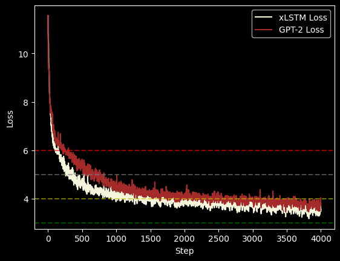

# A Survey Comparing xLSTM and Transformer Architectures

## Table of Contents
- [Abstract](#abstract)
- [Key Findings](#key-findings)
- [Technical Implementation](#technical-implementation)
- [Reproduce experiments](#reproduce-experiments)
- [Theoretical Overview](#theoretical-overview)
  - [xLSTM vs Traditional LSTM](#xlstm-vs-traditional-lstm)
- [References](#references)

## Abstract

This survey presents a comparison between the novel xLSTM architecture and the well-established GPT-2 transformer model. Through experimentation, I evaluated both architectures across five distinct benchmarks to assess their performance characteristics, training efficiency, and scalability.

## Key Findings

- xLSTM demonstrates superior performance compared to GPT-2
- However, xLSTM requires 2.45x more training time
- The results suggest a trade-off between performance and training efficiency
- Transformers remain a practical choice due to their better parallelization capabilities

The table below presents a comprehensive evaluation of both models (each containing 125M parameters) after training on 0.52B tokens:

| Benchmark    | Metric     | xLSTM Value            | GPT2 Value |
|--------------|------------|------------------------|------------|
| HellaSwag    | Accuracy   | **<u>0.2762</u>**      | 0.2633     |
| LAMBADA      | Perplexity | **<u>114.33</u>**      | 146.62     |
| WikiText-103 | Perplexity | **<u>72.43</u>**       | 91.37      |
| WikiText-2   | Perplexity | **<u>72.43</u>**       | 91.19      |
| PTB          | Perplexity | **<u>93.97</u>**       | 128.87     |

The xLSTM model demonstrates superior performance across all evaluated benchmarks, achieving consistently better results than GPT-2.

The loss curves comparison (shown below) further corroborates these findings, revealing xLSTM's enhanced learning capabilities and convergence properties.



## Technical Implementation

The [`llm-trainer`](https://github.com/Skripkon/llm_trainer) library was implemented to conduct this survey, which provides a streamlined pipeline for:
- Data preparation
- Model training
- Performance evaluation

## Reproduce experiments

1. Set up the environment:

```bash
conda env create -n xlstm -f environment.yaml 
conda activate xlstm
pip install xlstm llm-trainer
```

2. Rerun cells in `research/*.ipynb`


## Theoretical Overview

### xLSTM vs Traditional LSTM

xLSTM (Extended Long Short-Term Memory) represents a significant evolution from traditional LSTM networks through several key innovations:

1. **Matrix Memory**: Unlike traditional LSTM which uses vector-based memory, xLSTM introduces a matrix memory structure that allows for more complex state representations and better information storage.

2. **Exponential Gating**: xLSTM replaces the sigmoid gates of traditional LSTM with exponential gates, enabling more precise control over information flow and better gradient propagation.

3. **Parallel Processing**: The architecture is designed to support parallel computation of memory operations, addressing one of the main limitations of traditional LSTM.

4. **Scaled Dot-Product Attention**: xLSTM incorporates attention mechanisms similar to those in transformers, allowing it to better capture long-range dependencies.


## References

Maximilian Beck, Korbinian Pöppel, et al. xLSTM: Extended Long Short-Term Memory. ArXiv, 2405.04517, 2024.